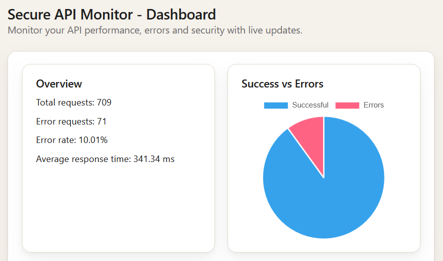
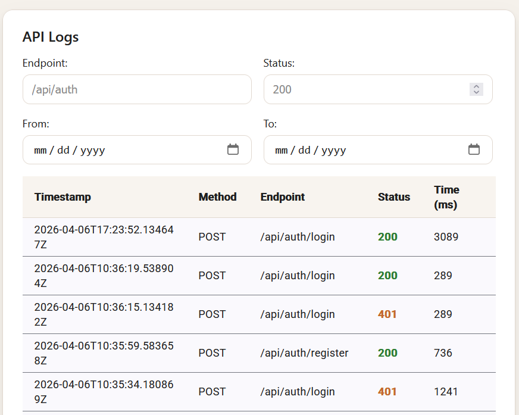
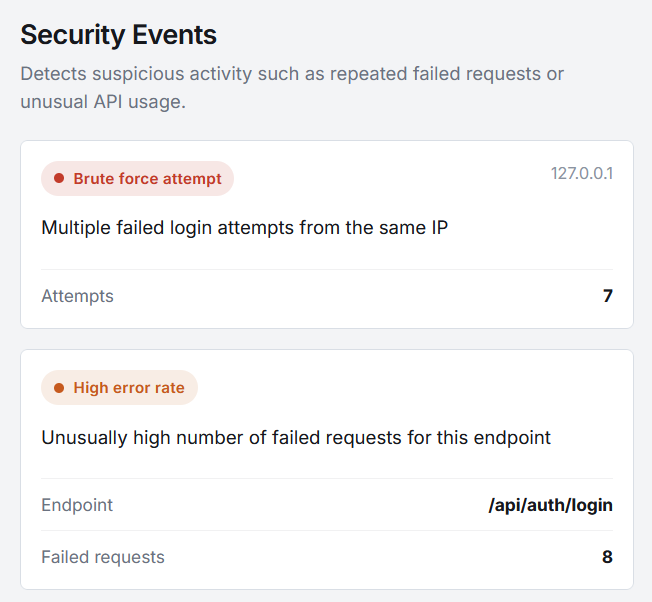

# Secure API Monitor

A fullstack web application for monitoring API activity, tracking security-related events, and visualizing system data through a clean dashboard interface.

---

## Features

- Authentication with JWT
- Secure password hashing
- Confirm password validation (frontend + backend)
- Input validation and protected endpoints
- API request logging via middleware
- Dashboard with charts and logs
- Security event tracking
- Activity with live updates (polling)
- Configurable refresh interval
- Dynamic system status (healthy, warning, critical) based on error rate
- Responsive UI optimized for mobile, tablet, and desktop

---

## Tech Stack

### Backend

- ASP.NET Core Web API
- Entity Framework Core
- JWT Authentication

### Database

- PostgreSQL (Neon)

### Frontend

- Angular (standalone components)
- Angular Material
- RxJS
- Chart.js / ng2-charts

---

## Project Structure

### Backend (`SecureApiMonitor.Api`)

- `Auth/` → JWT setup, ASP .NET Identity password hashing, auth requests
- `Controllers/` → API endpoints (auth, logs, stats, status)
- `Data/` → DbContext (ApplicationDbContext)
- `Dtos/` → Data transfer objects
- `Middleware/` → Request logging middleware
- `Models/` → Database entities (User, ApiRequestLog)
- `Validators/` → Input validation (login, register)
- `Migrations/` → Database history
- `Program.cs` → App configuration
- `appsettings.json` → Config (DB, JWT)

### Frontend (`frontend/dashboard/src/app`)

- `auth/` → Login, register, auth guard, auth service
- `core/` → Shared services (stats, settings)
- `dashboard/` → Dashboard components (logs table, charts)
- `layout/` → Navbar and sidebar
- `pages/` → Views (overview, logs, error stats, security events, settings)

---

## Setup

### Backend

```bash
cd backend/SecureApiMonitor.Api
dotnet restore
dotnet ef database update
dotnet run
```

After starting the backend, open your browser at:

http://localhost:5062/swagger

This is the Swagger UI where you can test all API endpoints.

### Frontend

```bash
cd frontend/dashboard
npm install
ng serve
```

---

## Testing

Tests are located in:

```bash
backend/SecureApiMonitor.Api.Tests
```

Run tests with:

```bash
cd backend/SecureApiMonitor.Api.Tests
dotnet test
```

Includes tests for:

- Authentication (login/register)
- Validation (invalid inputs)

---

## Data Flow

1. Client sends request → Backend API
2. Middleware logs request → stored in database
3. Frontend fetches logs and stats
4. Dashboard displays data with charts and tables

---

## Purpose

I built this project to understand how a fullstack system works in practice, from authentication and request logging in the backend to presenting data in a structured way in the frontend.

I also wanted to explore how API activity can be monitored and visualized in a way that is actually useful.

---

## What I Learned

- How to structure a backend with controllers, middleware, and database
- How JWT authentication works in practice
- How to log and track API requests
- How to connect an Angular frontend to a .NET API
- How to display data using charts and tables
- How different parts of a fullstack app interact with each other

---

## Screenshots

### Dashboard



### API Logs



### Security Alert



---

## Author

Jennifer – Junior Fullstack Developer
